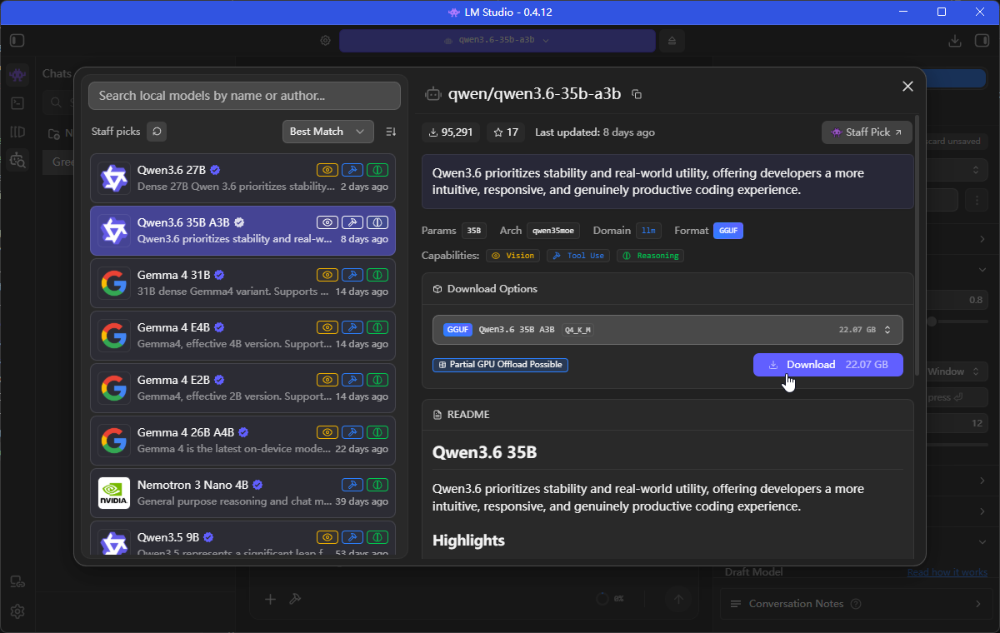
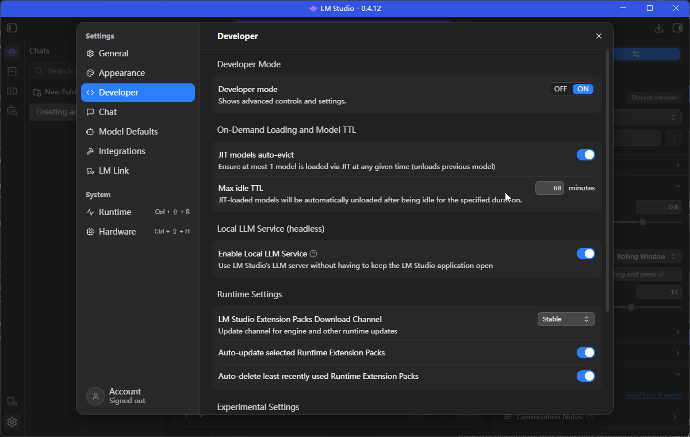
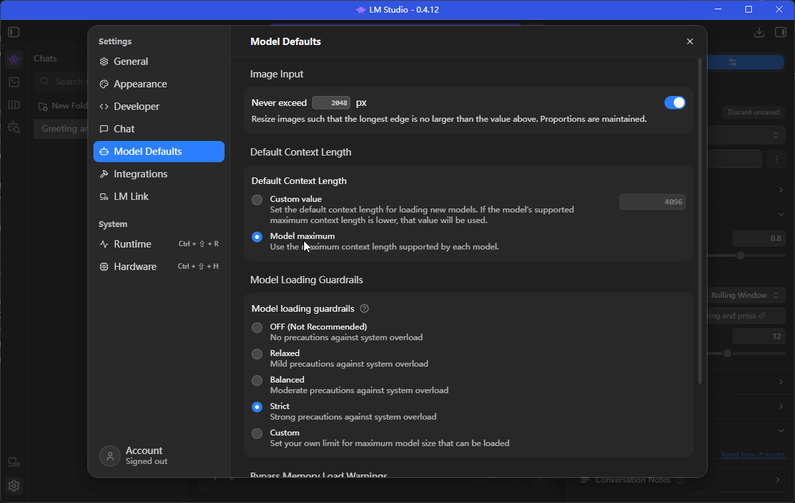

# Development Environment Setup

## 1. LM Studio Configuration

### Download Model

Enable Developer Utilities in LM Studio settings, then download the model.



### Enable Developer Options

Turn on the developer utilities switch in settings.



### Configure Context Length

Set context window to max for full document understanding.



## 2. Claude Code Plugin Switch Configuration

Create `~/.claude/settings.local.json` (or use the provided config) with local model proxy settings:

[cc-switch-config.json](./cc-switch-config.json)

Key configuration:
- **Base URL**: `http://localhost:1234` (LM Studio local server port)
- **Model**: `qwen/qwen3.6-35b-a3b`
- **API Timeout**: 3000000ms (50min, for long operations)
- **Enabled Plugins**: caveman, chrome-devtools-mcp

## 3. Start Services

### Step 1: Start LM Studio Local Server

1. Open LM Studio
2. Load `qwen/qwen3.6-35b-a3b` model
3. Click "Start Server" (local inference server)
4. Verify it's running on `http://localhost:1234`

### Step 2: Start Next.js Dev Server

```bash
npm run dev
```

Server starts at http://localhost:3000

### Step 3: Verify Connection

Test the local model proxy by running a simple Claude Code command. If requests complete successfully, the pipeline is working:

```
LM Studio (localhost:1234) → Claude Code → Anthropic MCP / External APIs
```
